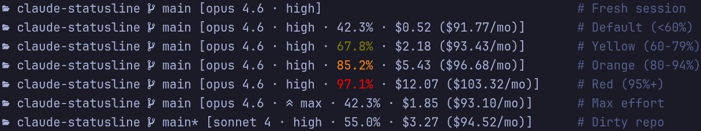

# Yet another Claude Code statusline

A minimal statusline for [Claude Code](https://docs.anthropic.com/en/docs/claude-code). One bash script - just the essentials at a glance.



Directory, git branch, dirty indicator, model, effort, context window usage (color-coded yellow at 60%, orange at 80%, red at 95%), session cost, and monthly accumulated cost.

## Install

Requires a [Nerd Font](https://www.nerdfonts.com/) configured in your terminal, `jq`, `git`, and `bash`.

YOLO:

```sh
curl -fsSL https://raw.githubusercontent.com/sk-ilya/claude-statusline/main/install.sh | bash
```

Or clone and run locally:

```sh
git clone https://github.com/sk-ilya/claude-statusline.git
cd claude-statusline
./install.sh
```

Restart Claude Code to activate.
